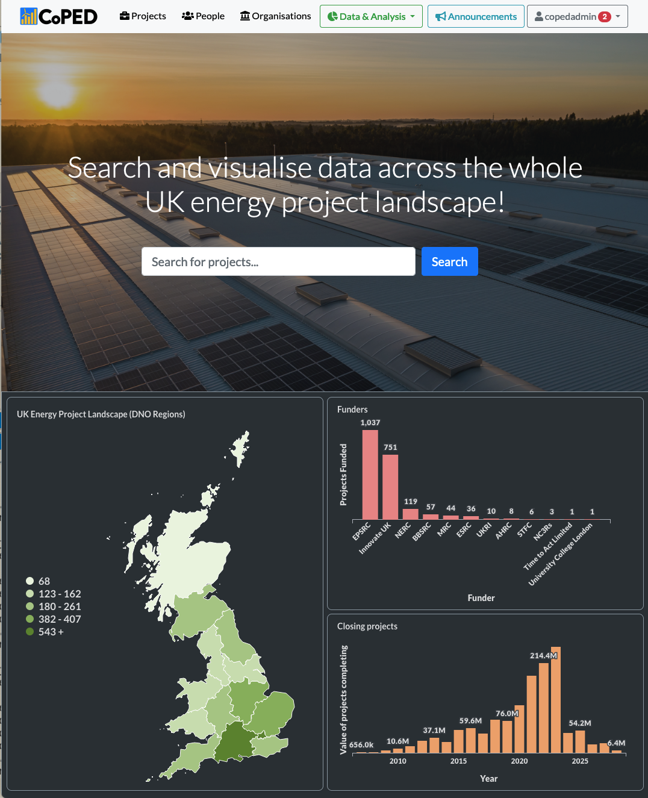

# COPED: Catalogue of Projects on Energy Data

> __Development Status:__ Alpha

**Fig 1 - COPED Front Page Screenshot**

COPED, or the Catalogue of Projects on Energy Data aims to unify various information stores and existing portals for energy projects under a single extendable umbrella that has two key roles:

1. Update, curate and correct information pertaining to the existing energy project landscape through manual and automated processes.
2. Offer a wide range of visual aids, query tools and metrics that enable users to synthesize information across the energy projects landscape at a given time.

COPED aims to provide diverse insights for various user groups, while being able to continuously expand its data capture sources and the analytics and visualisations it can perform.

As a platform, COPED aims to be extensible. As COPED reaches maturity and wide adoption, the product aims to allow individuals and institutions to contribute extensions and features to the product, as well as uploading, curating, and analysing existing data.
  

----

  
# COPED Development

This repository contains the COPED application code which is based around a microservices architecture, implemented as a fully containerised Docker application.

The codebase aims to allow easy setup and teardown of development and testing environments, and easy deployment of the production environment after updates.

The following guidance provides an overview of the development process for contributors.

## Development

[Docker compose](https://docs.docker.com/compose/) is used to orchestrate COPED services.

[GitHub Large File Storage](https://git-lfs.github.com/) installation is required to access test/demo data.

### Setup

1. Clone the repository (Git LFS must be installed).
2. Run `docker-compose build`.
3. Copy `.env.example` to `.env` and update any configuration you wish to use.
4. Run `docker-compose up -d db` to spin up the PostgreSQL database server.
5. Run `docker-compose exec -T db psql -U <coped> -d <coped_development> < dbdata/<sql_filename>` to populate the database, replacing `<variable>` with the appropriate value (find values in the `.env` file and in the `dbdata/` directory).

### Launch

1. Run `docker-compose up -d web` to launch the development web server.

You should now be able to access the web UI at `<hostname>:<port>` where `<port>` is the port configured in the `docker-compose.override.yaml` file and `<hostname>` is where you are serving from (e.g. localhost if you are developing locally or through a port-mapped tunnel).

## Testing

### Steps

1. Launch the application as above.
2. On the Docker host run `docker-compose exec web python manage.py test`.
